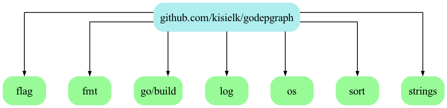

# godepgraph

godepgraph is a program for generating a dependency graph of Go packages.

## Install

    go install github.com/kisielk/godepgraph@latest

## Use

For basic usage, just give the package path of interest as the first
argument:

    godepgraph github.com/kisielk/godepgraph
    
If you intend to graph a go mod project, your package should be passed as a relative path:

    godepgraph ./pkg/api

The default output is a graph in [Graphviz][graphviz] dot format. If you have the
graphviz tools installed you can render it by piping the output to dot:

    godepgraph github.com/kisielk/godepgraph | dot -Tpng -o godepgraph.png

You can also generate [Mermaid](https://mermaid.js.org/) graphs:

    godepgraph -format mermaid github.com/kisielk/godepgraph > graph.mmd

By default godepgraph will display packages in the standard library in the
graph, though it will not delve in to their dependencies.

## Colors

godepgraph uses a simple color scheme to denote different types of packages:

  * *green*: a package that is part of the Go standard library, installed in `$GOROOT`.
  * *blue*: a regular Go package found in `$GOPATH`.
  * *yellow*: a vendored Go package found in `$GOPATH`.
  * *orange*: a package found in `$GOPATH` that uses cgo by importing the special package "C".

## Ignoring Imports

### The Go Standard Library

If you want to ignore standard library packages entirely, use the -s flag:

    godepgraph -s github.com/kisielk/godepgraph

### Vendored Libraries

If you want to ignore vendored packages entirely, use the -novendor flag:

    godepgraph -novendor github.com/something/else

### By Name

Import paths can be ignored in a comma-separated list passed to the -i flag:

    godepgraph -i github.com/foo/bar,github.com/baz/blah github.com/something/else

The packages and their imports will be excluded from the graph, unless the imports
are also imported by another package which is not excluded.

### By Prefix

Import paths can also be ignored by prefix. The -p flag takes a comma-separated
list of prefixes:

    godepgraph -p github.com,launchpad.net bitbucket.org/foo/bar

## Example

Here's some example output for godepgraph itself:

Using `godepgraph -format mermaid github.com/kisielk/godepgraph`:

Using `godepgraph -format graphviz github.com/kisielk/godepgraph`:

[graphviz]: http://graphviz.org

Here's the output of `godepgraph -format mermaid github.com/kisielk/errcheck`:

